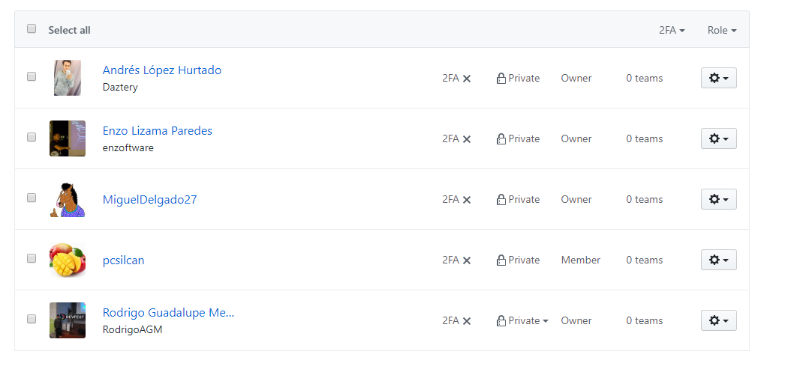

# Vote 4 Me - EVoting based in blockchain

  

## Resumen
---

Servicio de sistema de elecciones que utilicen reconocimiento facial para garantizar la legalidad de la identidad de los votantes. Resguardamos la seguridad del sistema mediante blockchain al centralizar los datos y protegerlos para evitar el fraude. Por ello, con nuestro sistema distribuido cualquier persona puede votar desde los módulos, mediante nuestra aplicación y se obtendrán los resultados garantizando la transparencia de quienes son los candidatos con mayor apoyo en las elecciones dadas.

---

## Índice
---
●	[Objetivo del Estudiante (Student Outcome)](#Objetivo-del-Estudiante-(Student-Outcome))  
●	[Capítulo 1: Presentación](#Capítulo-1-Presentación) 
●	[Capítulo 2: Marco](#Capítulo-2-Marco) 
&nbsp;&nbsp;&nbsp;&nbsp;o	[Marco teórico](#Marco-teórico) 
&nbsp;&nbsp;&nbsp;&nbsp;o	[Contexto del proyecto, industria de desarrollo](#Contexto-del-proyecto,-industria-de-desarrollo) 
●	[Capítulo 3: Gestión](#Capítulo-3-Gestión) 
&nbsp;&nbsp;&nbsp;&nbsp;o	[Evidencia de trabajo multidisciplinario](#Evidencia-de-trabajo-multidisciplinario) 
&nbsp;&nbsp;&nbsp;&nbsp;o	[Estimaciones de esfuerzo](#Estimaciones-de-esfuerzo) 
&nbsp;&nbsp;&nbsp;&nbsp;o	[Plan de comunicación y colaboración usando nueva tecnología](#Plan-de-comunicación-y-colaboración-usando-nueva-tecnología) 
●	[Capítulo 4: Implementación de solución](#Capítulo-4-Implementación-de-solución) 
●	[Conclusiones](#Conclusiones) 
●	[Recomendaciones](#Recomendaciones) 
●	[Glosario](#Glosario) 
●	[Bibliografía](#Bibliografía) 

---

---
## Objetivo del Estudiante (Student Outcome)

En el presente trabajo se tiene como uno de los principales objetivos conseguir la capacidad de funcionar efectivamente en un equipo en el cual todos los miembros juntos proporcionen liderazgo, creen un entorno de colaboración e inclusión, establezcan diversos objetivos a cumplir durante el desarrollo del proyecto, planifiquen las tareas mediante el uso de diversas herramientas tecnológicas y, sobretodo, cumplan satisfactoriamente los objetivos.

---
---
## Capítulo 1: Presentación

Muchas elecciones todavía usan un sistema basado en papel, dejando grandes agujeros de seguridad que podrían contribuir al fraude y la corrupción.

Sin embargo, piratear una cadena de bloques es casi imposible. Y con la nueva tecnología blockchain que se lanzará pronto, cualquier intrusión externa sería imposible. Asimismo, los datos de blockchain existen en un estado descentralizado. Como tal, es mucho más difícil de manipular que cualquier dato que se encuentre en un repositorio centralizado.

Como resultado, los estados de EE. UU. Están observando más de cerca la tecnología blockchain. California, por ejemplo, ha destinado $ 134.3 millones para ayudar a sus condados a instalar nuevos sistemas de votación o invertir en nuevas tecnologías como blockchain.

---
---
## Capítulo 2: Marco
### Marco teórico

La tecnología Blockchain ofrece a los votantes una mayor transparencia. Dada la naturaleza anónima de blockchain, muchas fuentes diferentes pueden seguir, contar y correlacionar los votos mientras se mantiene la privacidad de los votantes.

Como los registros de blockchain son inmutables, cualquier voto emitido no estará sujeto a eliminación. En cambio, los auditores podían contar y verificar con confianza todos los votos. Un sistema de votación blockchain también ofrecería resultados cifrados, fomentando así la transparencia y manteniendo la privacidad.

Asimismo, las elecciones, en su mayoría, son altamente ineficientes. Los sistemas en papel pueden tomar horas y, a veces, días para contar votos. El error humano y de la máquina, sin mencionar los fraudes, también puede confundir los resultados de la votación.

En contraste, un sistema de votación blockchain ofrece resultados inmediatos. Una vez que las encuestas hayan cerrado, los resultados certificables se conocerán de inmediato.

### Contexto del proyecto, industria de desarrollo
---
---
## Capítulo 3: Gestión
### Evidencia de trabajo multidisciplinario

Para evidenciar el trabajo multidisciplinario se usó Github projects y para validar las tareas se usó los issues en Github, por lo que cada tarea completada se cerraría el issue. Además que todos ayudamos a desarrollar el proyecto, tanto como en la documentación como en el desarrollo del sistema.

#### Tablero de Github Projects para el módulo de reconocimiento facial de Vote4Me 

 

#### Tablero de Github Projects para el módulo blockchain de Vote4Me 

 

### Estimaciones de esfuerzo

Para obtener la estimación de esfuerzo de cada uno de los integrantes del equipo en el desarrollo del proyecto, empleamos el conteo de contribuciones o "commits" de cada uno de los miembros en los 3 módulos de Vote4Me existentes: 

#### Contribuciones en el módulo de blockchain

 

#### Contribuciones en el módulo de reconocimiento facial

 

#### Contribuciones en el módulo web

 

### Plan de comunicación y colaboración usando nueva tecnología

Usamos diferentes tecnologías para la comunicación del equipo, primero usamos las redes sociales para la rápida y constante interacción con el equipo, además que usamos Github como tecnología principal para manejar las tareas pendientes y asimismo, usarlo como plataforma de control de versiones para nuestra organización. Además que veíamos el avance de cada integrante, se realizaba code review para observar algún error que podría tener el miembro.
 
 

#### Organización creada en Github

 

#### Miembros del equipo

 

---
## Capítulo 4: Implementación de solución

Para realiazar la implementación completa del proyecto, el equipo decidió dividir el trabajo en 3 módulos distintos. Cada uno de estos módulos fue implementado en un repositorio diferente dentro del controlador de versiones Github, mediante el cúal conseguimos llevar un mejor control de los avances y problemas del desarrollo.

Los módulos que se implementaron fueron: 

 

 

En el repositorio de face recognition, se trabajó la implementacion del módulo de reconocimiento facial para la aplicación Vote4Me. Este fue implementado utilizando python 3.5 con Tensorflow, OpenCV, Facenet y un modelo pre entrenado para el reconocimiento de imágenes.

En el repositorio de blockchain voting se trabajó principalmente la implementación del blockchain para la el manejo de los votos de cada uno de los usuarios. Esto se desarrolló de modo que sea posible utilizarlo de manera distribuida, considerando un nuevo nodo para cada uno de los usuarios conectados para realizar su voto. Esto fue implementado utilizando el lenguaje Go.

Por último, en repositorio de voting web contine la implementación de la interfaz web con una aplicación simple en Nodejs. Aqui se muestran a los votantes los diferentes candidatos que podrán seleccionar para realizar su voto, luego de haber sido identificados con el reconocimiento facial. 

 

----
## Conclusiones
<ul>
  <li>
Al saber que es muy seguro, algunas de las empresas quieren implementar esta tecnología en sus proyectos, pero como se sabe en Perú no está en el auge por lo que algunas empresas aún dudan implementarlo. Sin embargo, en el extranjero, este tipo de soluciones está siendo implementado hasta para sistemas financieros.
</li>
</ul>

---
## Recomendaciones
<ul>
  <li>
Se recomendó realizar un mejor manejo de la confidencialidad de los datos del votante al momento de enviar su voto al blockchain. Para esto se deberán realizar encriptaciones u otro tipo de medida antes de enviar los datos.
</li>
  <li>
Si se busca realizar la implementación de esta solución, será necesario realizar una mejor validación y evaluación de la aceptación que tendría por parte de la ciudadanía; ya que, la mayoría de personas aún no está acostumbrada a los avances tecnológicos.
</li>
</ul>

---
## Glosario

Blockchain: Según WeLiveSecurity(2018), La cadena de bloques, más conocida por el término en inglés blockchain, es un registro único, consensuado y distribuido en varios nodos de una red. En el caso de las criptomonedas, podemos pensarlo como el libro contable donde se registra cada una de las transacciones.

---
---
## Bibliografía
<ul>
  <li>
WeLiveSecurity(2018) Blockchain: qué es, cómo funciona y cómo se está usando en el mercado. Recuperado de <a href="https://www.welivesecurity.com/la-es/2018/09/04/blockchain-que-es-como-funciona-y-como-se-esta-usando-en-el-mercado/">https://www.welivesecurity.com/la-es/2018/09/04/blockchain-que-es-como-funciona-y-como-se-esta-usando-en-el-mercado/</a>
</li>
</ul>

---